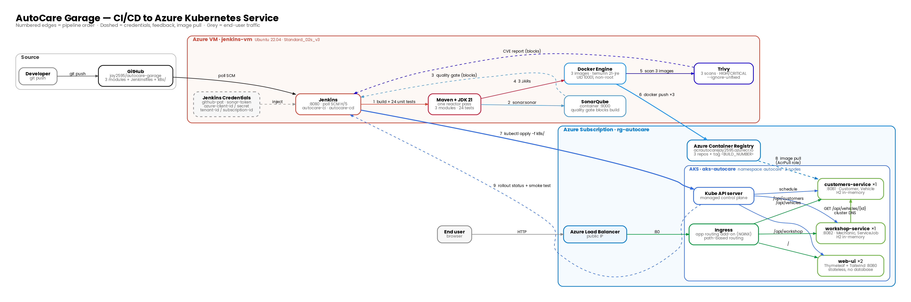

# AutoCare Garage

A vehicle servicing platform built as three Spring Boot microservices, deployed to
Azure Kubernetes Service by a Jenkins CI/CD pipeline with SonarQube analysis and
Trivy vulnerability scanning.



---

## Contents

- [What this is](#what-this-is)
- [The three services](#the-three-services)
- [Technology](#technology)
- [Running it locally](#running-it-locally)
- [Azure infrastructure](#azure-infrastructure)
- [Jenkins setup](#jenkins-setup)
- [The pipelines](#the-pipelines)
- [Kubernetes manifests](#kubernetes-manifests)
- [Demonstrating it](#demonstrating-it)
- [Troubleshooting](#troubleshooting)
- [Cost control and teardown](#cost-control-and-teardown)
- [Known limitations](#known-limitations)

---

## What this is

A garage books vehicles in for repair. Customers own vehicles, mechanics have
specialties, and service jobs link a vehicle to a mechanic with a status that moves
from Received through to Delivered.

The application is deliberately split across three independently deployable
services so the pipeline has something real to orchestrate: three Maven modules,
three Docker images, three vulnerability scans, three Kubernetes Deployments behind
one Ingress.

The interesting architectural detail is that `workshop-service` stores only a
`vehicleId`. The vehicle itself lives in `customers-service`, and is fetched over
HTTP at request time. If `customers-service` is unavailable, jobs still render,
just without vehicle details. That degradation is deliberate and is the easiest way
to demonstrate that these really are separate services.

## The three services

| Service | Port | Owns | Calls | Replicas |
|---|---|---|---|---|
| `customers-service` | 8081 | Customer, Vehicle | nothing | 1 |
| `workshop-service` | 8082 | Mechanic, Specialty, ServiceJob | customers-service | 1 |
| `web-ui` | 8080 | Thymeleaf pages, no data | both backends | 2 |

Each backend owns a private in-memory H2 database, seeded on startup. `web-ui`
holds no data at all.

### Entity model

```
customers-service            workshop-service
------------------           ----------------------
Customer                     Mechanic  ---- Specialty   (many-to-many)
   |  1..*                       |
   v                             |  mechanicId
Vehicle  <--------------------- ServiceJob
         vehicleId (no FK - different database)
```

There is no foreign key between `ServiceJob` and `Vehicle`, because they live in
different databases owned by different services. That is the defining constraint of
this architecture: each service owns its data and nobody reads anyone else's tables.

### API

**customers-service**

```
GET    /api/customers                 GET    /api/vehicles
GET    /api/customers?lastName=x      GET    /api/vehicles/{id}
GET    /api/customers/{id}
POST   /api/customers
PUT    /api/customers/{id}
DELETE /api/customers/{id}
GET    /api/customers/{id}/vehicles
POST   /api/customers/{id}/vehicles
```

**workshop-service**

```
GET    /api/workshop/jobs                      GET   /api/workshop/mechanics
GET    /api/workshop/jobs?status=IN_PROGRESS   GET   /api/workshop/mechanics/{id}
GET    /api/workshop/jobs?vehicleId=3          POST  /api/workshop/mechanics
GET    /api/workshop/jobs/{id}                 GET   /api/workshop/specialties
GET    /api/workshop/jobs/stats
POST   /api/workshop/jobs
PATCH  /api/workshop/jobs/{id}/status?status=COMPLETED
```

All three services expose `/actuator/health`, `/actuator/health/liveness`,
`/actuator/health/readiness`, `/actuator/info` and `/actuator/metrics`. The liveness
and readiness endpoints back the Kubernetes probes.

## Technology

| Layer | Choice |
|---|---|
| Language | Java 21 |
| Framework | Spring Boot 3.3.4 |
| Build | Maven 3.9 multi-module |
| Persistence | Spring Data JPA + H2 in-memory |
| UI | Thymeleaf server-side rendering + Tailwind via CDN |
| Testing | JUnit 5, MockMvc, AssertJ, JaCoCo |
| Container | Docker, `eclipse-temurin:21-jre-alpine`, non-root UID 10001 |
| CI/CD | Jenkins declarative pipelines |
| Code quality | SonarQube Community, quality gate blocks the build |
| Security | Trivy image scanning, blocks on fixable HIGH/CRITICAL |
| Registry | Azure Container Registry |
| Orchestration | Azure Kubernetes Service |
| Ingress | AKS application routing add-on (managed NGINX) |

Tailwind loads from a CDN rather than a build step, so there is no Node toolchain
anywhere in the pipeline.

## Running it locally

Requires JDK 21 and Maven 3.9+.

```bash
mvn clean package
```

Builds all three modules and runs the tests. Then, in three terminals — start
`customers-service` first:

```bash
java -jar customers-service/target/customers-service-1.0.0.jar
java -jar workshop-service/target/workshop-service-1.0.0.jar
java -jar web-ui/target/web-ui-1.0.0.jar
```

Open <http://localhost:8080>.

### With Docker Compose

```bash
mvn clean package
docker compose up --build
```

Same URL. The compose file wires the services together by container name, which is
the same shape as Kubernetes DNS.

### Verify

```bash
curl http://localhost:8081/actuator/health
curl http://localhost:8082/api/workshop/jobs/stats
curl http://localhost:8081/api/customers | head -c 400
```

`customersServiceReachable: true` in the stats response means the cross-service call
is working.

### See the databases

With the services running:

- <http://localhost:8081/h2-console> — JDBC URL `jdbc:h2:mem:customersdb`, user `sa`, no password
- <http://localhost:8082/h2-console> — JDBC URL `jdbc:h2:mem:workshopdb`

Two separate databases, no foreign key between them.

## Azure infrastructure

Everything lives in one resource group so teardown is a single command.

| Resource | Name | SKU |
|---|---|---|
| Resource group | `rg-autocare` | — |
| Container registry | `acrautocarejay2595` | Basic |
| Kubernetes cluster | `aks-autocare` | 2 × Standard_D2s_v3, free tier control plane |
| Jenkins VM | `jenkins-vm` | Standard_D2s_v3, Ubuntu 22.04 |

### Provisioning

```powershell
$RG="rg-autocare"; $LOC="eastus"
$ACR="acrautocarejay2595"; $AKS="aks-autocare"; $VM="jenkins-vm"

az group create --name $RG --location $LOC

az acr create --resource-group $RG --name $ACR --sku Basic --location $LOC

az aks create --resource-group $RG --name $AKS --location $LOC `
  --node-count 2 --node-vm-size Standard_D2s_v3 --tier free `
  --enable-managed-identity --attach-acr $ACR --generate-ssh-keys

az aks get-credentials --resource-group $RG --name $AKS
az aks approuting enable -g $RG -n $AKS

az vm create --resource-group $RG --name $VM --location $LOC `
  --image Ubuntu2204 --size Standard_D2s_v3 `
  --admin-username azureuser --generate-ssh-keys --public-ip-sku Standard
```

`--attach-acr` creates the `AcrPull` role assignment that lets the cluster pull
images without an `imagePullSecret`. Skipping it produces `ImagePullBackOff` at
deploy time with no obvious cause. Verify it:

```powershell
$ACRID   = az acr show --name $ACR --query id -o tsv
$KUBELET = az aks show -g $RG -n $AKS --query identityProfile.kubeletidentity.objectId -o tsv
az role assignment list --assignee $KUBELET --scope $ACRID --output table
```

### Network rules

Jenkins (8080) and SonarQube (9000) are restricted to a single source IP. An
internet-exposed Jenkins is found by scanners within hours.

```powershell
$MYIP = (Invoke-RestMethod https://api.ipify.org)
az network nsg rule create -g $RG --nsg-name "$VM`NSG" -n allow-jenkins `
  --priority 1001 --source-address-prefixes $MYIP --destination-port-ranges 8080 `
  --access Allow --protocol Tcp
```

## Jenkins setup

### Toolchain on the VM

Java 21, Jenkins LTS, Maven 3.9.9 at `/opt/maven`, Docker CE, Trivy, Azure CLI,
kubectl, and SonarQube as a container.

Two things that are easy to miss:

```bash
# Jenkins must be in the docker group or every Docker stage fails with
# "permission denied on /var/run/docker.sock"
sudo usermod -aG docker jenkins && sudo systemctl restart jenkins

# SonarQube embeds Elasticsearch, which refuses to start below this value
sudo sysctl -w vm.max_map_count=262144
echo "vm.max_map_count=262144" | sudo tee -a /etc/sysctl.conf
```

### Credentials

| ID | Kind | Purpose |
|---|---|---|
| `github-pat` | Username with password | Clone the repository |
| `sonar-token` | Secret text | SonarQube analysis |
| `azure-client-id` | Secret text | Service principal appId |
| `azure-client-secret` | Secret text | Service principal password |
| `azure-tenant-id` | Secret text | Directory tenant |
| `azure-subscription-id` | Secret text | Target subscription |

The service principal is scoped to the resource group, not the subscription — if it
leaks, the blast radius is one resource group.

```powershell
$SP = az ad sp create-for-rbac --name "sp-jenkins-autocare" `
  --role Contributor --scopes "/subscriptions/$SUBID/resourceGroups/$RG" `
  --output json | ConvertFrom-Json

# Contributor covers the management plane but not ACR's data plane
az role assignment create --assignee $($SP.appId) --role AcrPush --scope $ACRID
```

### Tools and servers

- **Tools → JDK**: name `jdk21`, JAVA_HOME `/usr/lib/jvm/java-21-openjdk-amd64`
- **Tools → Maven**: name `maven3`, MAVEN_HOME `/opt/maven`
- **System → SonarQube servers**: name `sonarqube`, URL `http://localhost:9000`, token `sonar-token`

### SonarQube webhook

Required, or `waitForQualityGate` hangs until timeout.

**Administration → Configuration → Webhooks**, URL `http://172.17.0.1:8080/sonarqube-webhook/`

`localhost` will not work and SonarQube now rejects it outright. The webhook is sent
*from inside the SonarQube container*, where `localhost` is the container itself.
`172.17.0.1` is the Docker bridge gateway — the container's route to the host.

### Jobs

| Job | Script Path | Trigger |
|---|---|---|
| `autocare-ci` | `Jenkinsfile` | Poll SCM `H/5 * * * *` |
| `autocare-cd` | `Jenkinsfile.cd` | Triggered by CI, or manual with a tag |

Both are Pipeline jobs using *Pipeline script from SCM*.

## The pipelines

### Build pipeline — `Jenkinsfile`

| Stage | What it does |
|---|---|
| Checkout | Clones the repo |
| Build & Unit Test | `mvn clean verify` — compiles 3 modules, runs the tests, produces JaCoCo coverage |
| Code Analysis | `mvn sonar:sonar` via `withSonarQubeEnv` |
| Quality Gate | Blocks on SonarQube's verdict, fails the build if red |
| Archive JARs | Fingerprinted build artifacts |
| Docker Build | 3 images tagged `<BUILD_NUMBER>` and `latest` |
| Trivy Scan | 3 scans, fails on fixable HIGH/CRITICAL |
| Push to ACR | `az acr login`, then 6 pushes |
| Trigger CD | Starts `autocare-cd` with this build number |

Two parameters let you relax the gates without editing code:
`FAIL_ON_VULNERABILITIES` and `DEPLOY_AFTER_BUILD`.

### Release pipeline — `Jenkinsfile.cd`

| Stage | What it does |
|---|---|
| Validate input | Refuses to run without an explicit `IMAGE_TAG` |
| Checkout | Clones the manifests |
| Connect to AKS | SP login, then `az aks get-credentials` |
| Verify images exist | Confirms all 3 tags are in ACR before touching the cluster |
| Apply manifests | Renders `__IMAGE_TAG__` into a throwaway copy, applies it |
| Monitor rollout | `kubectl rollout status` on all 3 Deployments |
| Smoke test | Health, both APIs and the home page, through the public ingress |

On failure, `post { failure }` runs `kubectl rollout undo` on all three Deployments.
Combined with `maxUnavailable: 0`, a bad deploy never takes the site down.

`kubectl describe pods` and the namespace event log are archived on every run,
successful or not — when a failed deploy's pods have already been replaced, those
files are often the only record of what happened.

### Why the image tag is a parameter, not a commit

The manifests in git contain `__IMAGE_TAG__` permanently. The pipeline substitutes
the real tag at deploy time into a `k8s-rendered/` copy that is never committed.

Git therefore describes the *shape* of the deployment; the pipeline decides the
*version*. Rolling back to build 3 is running the CD job with `IMAGE_TAG=3` —
fifteen seconds, no commit. If the tag lived in the YAML, every redeploy would need
a commit and the history would fill with "bump tag" noise.

## Kubernetes manifests

```
k8s/
├── 00-namespace.yaml          Namespace: autocare
├── 10-customers-service.yaml  Deployment + ClusterIP Service
├── 20-workshop-service.yaml   Deployment + ClusterIP Service
├── 30-web-ui.yaml             Deployment (2 replicas) + ClusterIP Service
└── 40-ingress.yaml            Path-based routing
```

### Ingress routing

| Path | Service |
|---|---|
| `/api/customers`, `/api/vehicles` | customers-service:8081 |
| `/api/workshop` | workshop-service:8082 |
| `/` | web-ui:8080 |

Only `web-ui` strictly needs to be public. The API paths are exposed so each service
can be shown to be independently alive during a demo.

### Decisions worth explaining

**Replica counts differ on purpose.** `web-ui` runs 2 replicas because it is
stateless. The backends run 1 because each pod holds its own in-memory H2 database —
two replicas would serve divergent data.

**`startupProbe` is separate from `livenessProbe`.** Spring Boot needs ~20 seconds
to start. Without a startup probe, liveness begins checking immediately, fails,
kills the pod, and produces a CrashLoopBackOff that looks like an application bug
but is purely probe misconfiguration.

**`runAsUser: 10001` matches the Dockerfile.** Kubernetes verifies `runAsNonRoot` by
reading the image config before starting the container. A named user (`USER
autocare`) cannot be verified without starting the container first, so the kubelet
refuses with `CreateContainerConfigError`. The UID must be numeric in both places.

**`maxUnavailable: 0`.** New pods become ready before old ones terminate. Zero
downtime during a rolling update.

**No `imagePullSecrets`.** The `AcrPull` role assignment on the cluster's kubelet
identity handles registry authentication.

## Demonstrating it

**End to end.** Push a commit. Within five minutes Jenkins polls, builds, tests,
analyses, scans, pushes and deploys, then smoke-tests itself. No manual step.

**Zero-downtime deploy.** Run the CD job while refreshing the site. `kubectl get
pods -n autocare -w` shows new pods reaching Ready before old ones terminate.

**Rollback.** Run the CD job with `IMAGE_TAG=999`. The Verify stage stops it before
the cluster is touched. For a real rollback, deploy an older tag.

**Service independence.**

```bash
kubectl scale deployment customers-service -n autocare --replicas=0
```

Reload the job board. Jobs still list; every vehicle reads `Vehicle #n
(unavailable)`; the Services page turns that tile red. Scale back to 1 and the
details return. This is the clearest demonstration that the split is real.

**Self-healing.**

```bash
kubectl delete pod -l app=web-ui -n autocare
```

The Deployment replaces them immediately, and the site stays up because there were
two.

## Troubleshooting

| Symptom | Cause |
|---|---|
| `CreateContainerConfigError` | Missing ConfigMap/Secret, or `runAsNonRoot` with a non-numeric image user |
| `ImagePullBackOff` | `AcrPull` role assignment missing, or the tag does not exist in ACR |
| Quality Gate stage hangs 5 minutes | SonarQube webhook wrong or missing. Check Recent deliveries |
| `permission denied /var/run/docker.sock` | `jenkins` user not in the `docker` group, or Jenkins not restarted after |
| `No plugin found for prefix 'sonar'` | `sonar-maven-plugin` not declared in the parent POM |
| `mvn: not found` in a stage | Tool name in `tools {}` does not match Manage Jenkins → Tools |
| SonarQube container exits on start | `vm.max_map_count` below 262144 |
| Pod `Running` but never `1/1` | Readiness probe failing — `kubectl logs` and `kubectl describe pod` |

## Cost control and teardown

Roughly $7/day with everything running.

```powershell
# end of a working session
az aks stop -g rg-autocare -n aks-autocare
az vm deallocate -g rg-autocare -n jenkins-vm

# resume
az aks start -g rg-autocare -n aks-autocare
az vm start -g rg-autocare -n jenkins-vm

# permanent teardown
az group delete --name rg-autocare --yes --no-wait
az ad app delete --id <service-principal-appId>
```

`az vm deallocate`, not `az vm stop` — the latter leaves the VM allocated and still
billing.

## Known limitations

**In-memory databases.** Data resets on every pod restart, and the backends cannot
be scaled beyond one replica without serving divergent data. The honest fix is a
PostgreSQL StatefulSet with a PersistentVolumeClaim, or Azure Database for
PostgreSQL. The application config already reads its datasource from the
environment, so this is a manifest change plus a driver dependency.

**No TLS.** The ingress serves plain HTTP. Production would want cert-manager with
Let's Encrypt, or an Azure-managed certificate.

**No authentication.** Every endpoint is open. The app is a pipeline demonstration,
not a product.

**Polling, not webhooks.** CI polls GitHub every five minutes. A webhook would be
instant, and would work here since the VM has a public IP, but it requires opening
port 8080 to GitHub's address ranges.

**Single environment.** No dev/staging/prod separation. A realistic next step is
separate namespaces with the CD job taking the target as a parameter.
